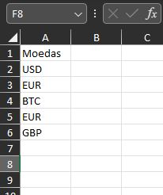
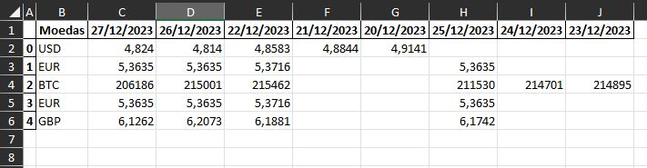

# Programa de Cotação de Moedas
Uma aplicação Python para cotação de moedas com interface gráfica usando Tkinter, API, Requests e Pandas. 

Esse programa faz parte do meu portifólio de estudos, utilizando vários conceitos de programação em um único mini projeto.


## Funcionalidades

- **Consulta de Moeda Única:** Escolha uma moeda e uma data para obter a cotação correspondente.
- **Consulta de Múltiplas Moedas:** Importe um arquivo Excel com uma lista de moedas e atualize as cotações para um período específico.
- **Interface Gráfica Amigável:** Interaja com o programa por meio de uma interface intuitiva.

## Pré-requisitos

Certifique-se de ter as bibliotecas necessárias instaladas:
- Tkinter
- Requests
- Pandas
- Openpyxl

```bash
pip install tk tkcalendar requests pandas openpyxl
```

## Como Usar

1. Execute o arquivo Python: `sistemaCotacao.py`
2. Escolha a moeda e a data desejada para obter a cotação.
3. Veja a cotação na hora ao lado do botão.

   OU
   
5. Importe um arquivo Excel e defina o período para atualizar as cotações de várias moedas.
   > OBS: O Arquivo em excel deve seguir o padrão: Célula A1 com título, e todas as moedas em linhas separadas.
   
6. Consulte a saída no arquivo "Teste.xlsx", salvo na mesma pasta do arquivo selecionado acima.
      

## Contribuições

Contribuições são bem-vindas! Para problemas, sugestões ou melhorias, abra uma issue ou envie um pull request.
